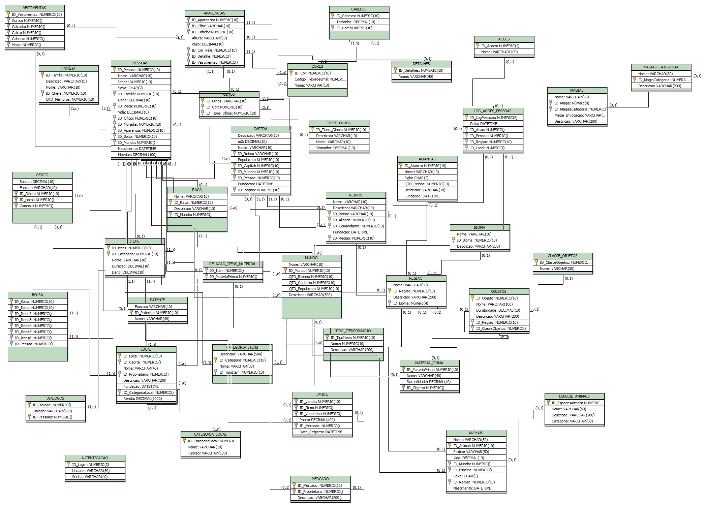

# ESQUEMA DE DADOS DE MUNDO RPG

O objetivo deste repositório é armazenar todo o esquema cronológico de uma base de dados para um futuro desenvolvimento de anos luz...

- Autor: Stefane de Assis Orichuela
- Modelo LÓGICO: brModelo 3.0 

## METAS EM DESENVOLVIMENTO: 
- [x] Desenvolvimento do modelo LÓGICO
- [x] Concertando relacionamentos
- [x] Ajustando tamanho das colunas
- [x] Criando tabelas de Magia 
- [x] Passando primeiro RASCUNHO para Modelo Físico
- [ ] Automoção com TRIGGERS
- [ ] Inserção de dados-teste
- [ ] Criação de VIEWS

## METAS FUTURAS:
- [ ] Criação de Wireframe

### MODELO LÓGICO:

